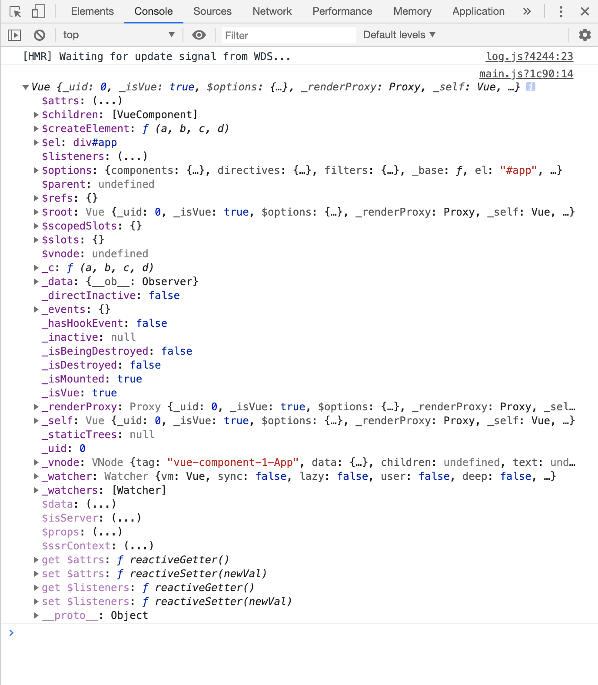

# new Vue()的时候发生了什么

从源码分析，`new Vue()`实际上就是调用了原型上的`_init()`方法，那么`_init()`方法做了什么？

执行如下代码，打印vue实例

```javascript
let vue = new Vue({
  el: '#app',
  // router,
  components: { App },
  template: '<App/>',
});
console.log(vue)
```

结果如下：



```javascript
export function initMixin (Vue: Class<Component>) {
  // Vue的原型链上添加 _init 方法
  Vue.prototype._init = function (options?: Object) {
    // 定义vm等于当前实例
    const vm: Component = this
    // a uid
    vm._uid = uid++ // 当前实例的uid加1

    let startTag, endTag
    /* istanbul ignore if */
    // 非生产环境 & 记录性能 & mark存在
    if (process.env.NODE_ENV !== 'production' && config.performance && mark) {
      startTag = `vue-perf-start:${vm._uid}`
      endTag = `vue-perf-end:${vm._uid}`
      // 相当于 window.performance.mark(startTag)
      mark(startTag)
    }

    // a flag to avoid this being observed
    // 如果是Vue的实例，则不需要被observe
    vm._isVue = true

    // 合并配置项
    if (options && options._isComponent) {// 如果 options 存在并且有子组件时，options._isComponent为true
      // optimize internal component instantiation
      // since dynamic options merging is pretty slow, and none of the
      // internal component options needs special treatmen
      // 内部component 的options初始化
      initInternalComponent(vm, options)
    } else {// 非内部Component的 options 初始化
      // 将options进行合并
      vm.$options = mergeOptions(
        resolveConstructorOptions(vm.constructor),
        options || {},
        vm
      )
    }
    /* istanbul ignore else */
    // 在render中将this指向vm._renderProxy
    if (process.env.NODE_ENV !== 'production') {
      initProxy(vm)
    } else {
      vm._renderProxy = vm
    }
    // expose real self
    vm._self = vm
    initLifecycle(vm)// 初始化生命周期
    initEvents(vm)// 初始化事件
    initRender(vm)// 初始化渲染
    callHook(vm, 'beforeCreate') // 回调 beforeCreate 钩子函数
    initInjections(vm) // resolve injections before data/props，初始化injections
    initState(vm)// 初始化state，响应式
    initProvide(vm) // resolve provide after data/props，初始化provide
    callHook(vm, 'created')// created

    /* istanbul ignore if */
    if (process.env.NODE_ENV !== 'production' && config.performance && mark) {
      vm._name = formatComponentName(vm, false)
      mark(endTag)
      measure(`vue ${vm._name} init`, startTag, endTag)
    }

    // 挂载实例
    if (vm.$options.el) {
      vm.$mount(vm.$options.el)
    }
  }
}
```

可以看出，`_init()`函数主要做了如下几件事：
配置合并

```javascript
vm._self = vm
initLifecycle(vm)// 初始化生命周期
initEvents(vm)// 初始化事件
initRender(vm)// 初始化渲染
callHook(vm, 'beforeCreate') // 回调 beforeCreate 钩子函数
initInjections(vm) // resolve injections before data/props，初始化injections
initState(vm)// 初始化state，包括props,methods,data,computed,watch的初始化
initProvide(vm) // resolve provide after data/props，初始化provide
callHook(vm, 'created')// created
挂载实例， vm.$mount(vm.$options.el)
```

三、initLifecycle

```javascript
export function initLifecycle (vm: Component) {
  // 将配置合并完成的结果赋值给options
  const options = vm.$options

  // locate first non-abstract parent
  let parent = options.parent
  if (parent && !options.abstract) {
    while (parent.$options.abstract && parent.$parent) {
      parent = parent.$parent
    }
    parent.$children.push(vm)
  }

  vm.$parent = parent // 指定已创建的实例之父实例，在两者之间建立父子关系。子实例可以用 this.$parent 访问父实例，子实例被推入父实例的 $children 数组中。
  vm.$root = parent ? parent.$root : vm // 当前组件树的根 Vue 实例。如果当前实例没有父实例，此实例将会是其自己。

  vm.$children = [] // 当前实例的直接子组件。需要注意 $children 并不保证顺序，也不是响应式的。
  vm.$refs = {}// 一个对象，持有已注册过 ref 的所有子组件

  vm._watcher = null // 组件实例相应的 watcher 实例对象。
  vm._inactive = null // 表示keep-alive中组件状态，如被激活，该值为false,反之为true。
  vm._directInactive = false// 也是表示keep-alive中组件状态的属性。
  vm._isMounted = false// 当前实例是否完成挂载(对应生命周期图示中的mounted)。
  vm._isDestroyed = false//当前实例是否已经被销毁(对应生命周期图示中的destroyed)。
  vm._isBeingDestroyed = false// 当前实例是否正在被销毁,还没有销毁完成(介于生命周期图示中deforeDestroy和destroyed之间)。
}
```

四、initEvents

```javascript
export function initEvents (vm: Component) {
  vm._events = Object.create(null)
  vm._hasHookEvent = false
  // init parent attached events
  const listeners = vm.$options._parentListeners
  if (listeners) {
    updateComponentListeners(vm, listeners)
  }
}
```

五、initRender

```javascript
export function initRender (vm: Component) {
  vm._vnode = null // the root of the child tree
  vm._staticTrees = null // v-once cached trees
  const options = vm.$options
  const parentVnode = vm.$vnode = options._parentVnode // the placeholder node in parent tree
  const renderContext = parentVnode && parentVnode.context
  vm.$slots = resolveSlots(options._renderChildren, renderContext)
  vm.$scopedSlots = emptyObject
  // bind the createElement fn to this instance
  // so that we get proper render context inside it.
  // args order: tag, data, children, normalizationType, alwaysNormalize
  // internal version is used by render functions compiled from templates
  vm._c = (a, b, c, d) => createElement(vm, a, b, c, d, false)
  // normalization is always applied for the public version, used in
  // user-written render functions.
  vm.$createElement = (a, b, c, d) => createElement(vm, a, b, c, d, true)

  // $attrs & $listeners are exposed for easier HOC creation.
  // they need to be reactive so that HOCs using them are always updated
  const parentData = parentVnode && parentVnode.data

  /* istanbul ignore else */
  if (process.env.NODE_ENV !== 'production') {
    defineReactive(vm, '$attrs', parentData && parentData.attrs || emptyObject, () => {
      !isUpdatingChildComponent && warn(`$attrs is readonly.`, vm)
    }, true)
    defineReactive(vm, '$listeners', options._parentListeners || emptyObject, () => {
      !isUpdatingChildComponent && warn(`$listeners is readonly.`, vm)
    }, true)
  } else {
    defineReactive(vm, '$attrs', parentData && parentData.attrs || emptyObject, null, true)
    defineReactive(vm, '$listeners', options._parentListeners || emptyObject, null, true)
  }
}
```

六、initState

```javascript
// 初始化state，包括props,methods,data,computed,watch等的初始化
// 可以看出，为什么props是现在data之前执行的
export function initState (vm: Component) {
  vm._watchers = []
  const opts = vm.$options
  if (opts.props) initProps(vm, opts.props)
  if (opts.methods) initMethods(vm, opts.methods)
  if (opts.data) {
    initData(vm)
  } else {
    observe(vm._data = {}, true /* asRootData */)
  }
  if (opts.computed) initComputed(vm, opts.computed)
  if (opts.watch && opts.watch !== nativeWatch) {
    initWatch(vm, opts.watch)
  }
}
```

笔记：
一、定义一个函数 给其他的文件调用，同时自己也可以用
function a(){
    b()
}
export function b(){}