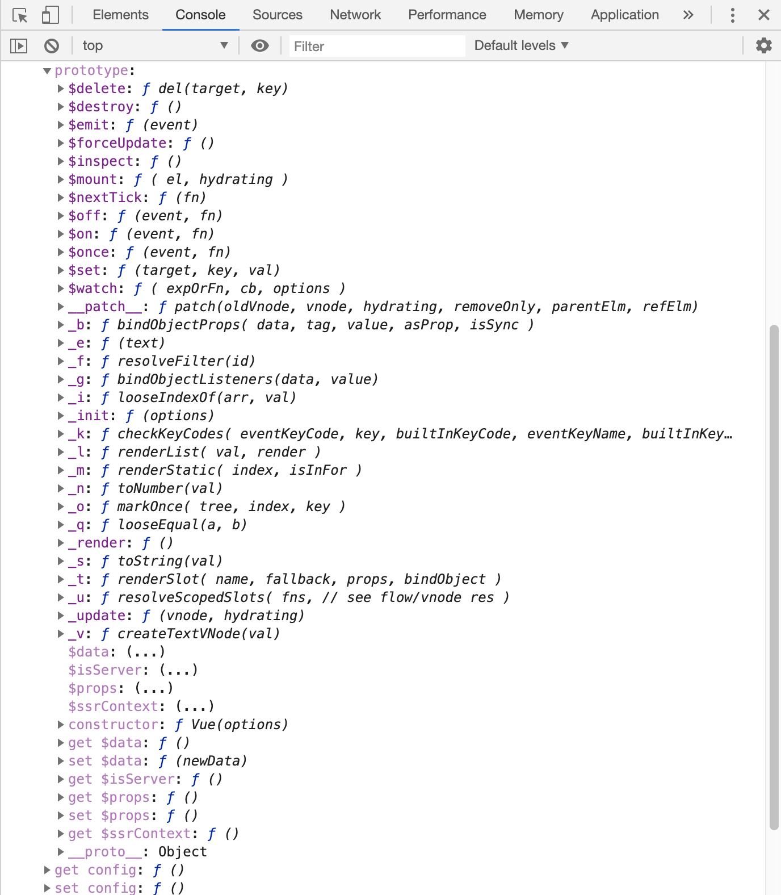

```javascript
import Vue from 'vue'
// 打印出引入的Vue
console.dir(Vue)
```
结果如下图：


点开prototype,结果如下图：



1. 先执行了下面的5个mixin函数
- initMixin(Vue) // Vue.prototye上添加了`_init`方法
- stateMixin(Vue) // Vue.prototye上定义了属性: `$data、$props，方法：$set、$delete、$watch`
- eventsMixin(Vue)// Vue.prototye上添加了四个方法: `$on、 $once 、$off 、$emit`
- lifecycleMixin(Vue)// lifecycleMixin(Vue)，在原型Vue.prototye上添加了三个方法：`_update 、$forceUpdate 、$destory`
- renderMixin(Vue)// Vue.prototye上添加了方法：`$nextTick 、_render、 _o、 _n、 _s、 _l、 _t、 _q、 _i、 _m、 _f、 _k、 _b、 _v、 _e、 _u、 _g、 _d、 _p`


2. 然后执行如下代码，在`src/core/index.js`中

```javascript
import Vue from './instance/index'
import { initGlobalAPI } from './global-api/index'
import { isServerRendering } from 'core/util/env'
import { FunctionalRenderContext } from 'core/vdom/create-functional-component'

/**
 * 作用：给构造函数Vue定义全局的静态属性和静态方法
 * 定义静态属性，给Vue添加属性config，options
 * 定义静态方法，util,set,del,nextTick,use,mixin,,extend,directive,component,filter
 */
initGlobalAPI(Vue)

// Vue.prototype上添加属性 $isServer
Object.defineProperty(Vue.prototype, '$isServer', {
  get: isServerRendering
})
// Vue.prototype上添加属性 $ssrContext
Object.defineProperty(Vue.prototype, '$ssrContext', {
  get () {
    /* istanbul ignore next */
    return this.$vnode && this.$vnode.ssrContext
  }
})

// expose FunctionalRenderContext for ssr runtime helper installation
Object.defineProperty(Vue, 'FunctionalRenderContext', {
  value: FunctionalRenderContext
})
// package.json中的version
Vue.version = '__VERSION__'

export default Vue
```


initGlobalAPI(Vue)：
```javascript
/* @flow */

import config from '../config'
import { initUse } from './use'
import { initMixin } from './mixin'
import { initExtend } from './extend'
import { initAssetRegisters } from './assets'
import { set, del } from '../observer/index'
import { ASSET_TYPES } from 'shared/constants'
import builtInComponents from '../components/index'

import {
  warn,
  extend,
  nextTick,
  mergeOptions,
  defineReactive
} from '../util/index'

/**
 * 作用：给构造函数Vue定义静态属性和静态方法
 * 定义静态属性，给Vue添加属性config，options
 * 定义静态方法，util,set,del,nextTick,use,mixin,,extend,directive,component,filter
 * @param {*} Vue
 */
export function initGlobalAPI (Vue: GlobalAPI) {
  // config
  // 给configDef对象添加get，set方法
  const configDef = {}
  configDef.get = () => config
  if (process.env.NODE_ENV !== 'production') {
    configDef.set = () => {
      warn(
        'Do not replace the Vue.config object, set individual fields instead.'
      )
    }
  }
  // 给Vue添加属性config = configDef
  Object.defineProperty(Vue, 'config', configDef)

  // exposed util methods.
  // NOTE: these are not considered part of the public API - avoid relying on
  // them unless you are aware of the risk.
  // 虽然暴露了一些辅助方法，但官方并不将它们列入公共API中，不鼓励外部使用
  Vue.util = {
    warn,
    extend,
    mergeOptions,
    defineReactive
  }

  // 设置响应式对象的响应式属性，强制触发视图更新，在数组更新中非常实用，不适用于根数据属性
  Vue.set = set
  // 删除响应式属性强制触发视图更新， 使用情境较少。
  Vue.delete = del
  // 结束此轮循环后执行回调，常用于需要等待DOM更新或加载完成后执行的功能。
  Vue.nextTick = nextTick

  // 给Vue添加一个纯净的options属性
  Vue.options = Object.create(null)
  // 给Vue.options添加三个属性Vue.options = { components:{},directives:{},filters:{}}
  ASSET_TYPES.forEach(type => {
    Vue.options[type + 's'] = Object.create(null)
  })

  // this is used to identify the "base" constructor to extend all plain-object
  // components with in Weex's multi-instance scenarios.
  // 给Vue.options添加属性_base = Vue
  Vue.options._base = Vue
  // 将keepAlive对象添加到Vue.options.components上
  extend(Vue.options.components, builtInComponents)
  // 向Vue类挂载静态方法
  // 给Vue添加use方法，安装插件，自带规避重复安装
  initUse(Vue)
  // 给Vue添加mixin方法，常用于混入插件功能，不推荐在应用代码中使用。
  initMixin(Vue)
  // 给Vue添加extend方法，创建基于Vue的子类并扩展初始内容。
  initExtend(Vue)
  // 全局API 资源获取和注册,directive:注册全局指令、component:注册全局组件、filter:注册全局过滤器
  initAssetRegisters(Vue)
}
```

思考：
为什么我们能够使用全局的api ?就是因为initGlobalAPI(Vue)这个函数，给Vue构造函数添加了这些全局的静态属性和方法


