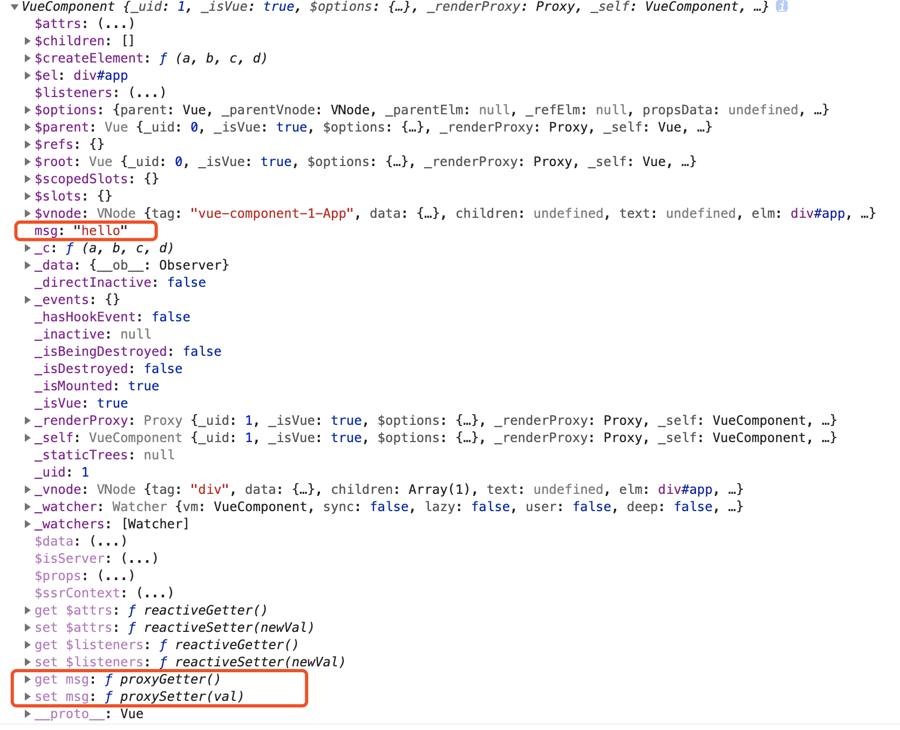

# initData

分析：

* 获取当前实例`vm`的上的`$options.data`，并判断它是否是一个函数（这是为什么我们定义data的时候，可以是对象，可以是函数
* 如果data（处理后的结果）不是一个纯对象，则提示`data functions should return an object:`
* 获取data的所有key组成的数组，遍历该数组：
    * 判断data中的属性是否在props或者methods中已经被定义，从 [initState](./initState.md) 我们可以知道props，methods是先执行的
    * 如果data中定义的变量key不是以$或者是_命名， 调用`proxy(vm, _data, key)`,将data中的key代理到vm实例上
* 监听数据变化 `observe(data, true /* asRootData */)`,这一段暂不分析

``` javascript
// 初始化data
function initData (vm: Component) {
  // 获取当前实例vm配置项中的data，即组件中定义的data，是一个对象
  let data = vm.$options.data
  // 如果 当前实例vm配置项中的data 是一个函数，调用方法 getData(data, vm)，
  // 否则直接获取 当前实例vm配置项中的data 赋值给data变量，同时给当前实例增加属性_data
  data = vm._data = typeof data === 'function'
    ? getData(data, vm)
    : data || {}

  // 如果data不是一个纯对象，提示data函数必须返回一个对象
  if (!isPlainObject(data)) {
    data = {}
    process.env.NODE_ENV !== 'production' && warn(
      'data functions should return an object:\n' +
      'https://vuejs.org/v2/guide/components.html#data-Must-Be-a-Function',
      vm
    )
  }
  // proxy data on instance
  // 获取data对象所有的key组成的数组keys
  const keys = Object.keys(data)
  // 获取当前实例vm配置上的props
  const props = vm.$options.props
  // 获取当前实例vm配置上的methods
  const methods = vm.$options.methods
  // 定义data对象所有key组成的数组的长度
  let i = keys.length
  // 遍历 数组keys
  while (i--) {
    // 获取data对象当前的key
    const key = keys[i]
    // 如果methods存在，检测data中定义的key是否存在于methods中
    // 这就是为什么我们不能定义同名的data和methods
    if (process.env.NODE_ENV !== 'production') {
      if (methods && hasOwn(methods, key)) {
        warn(
          `Method "${key}" has already been defined as a data property.`,
          vm
        )
      }
    }

    if (props && hasOwn(props, key)) {
       // 如果props存在，检测data中定义的key是否存在于props中
       // 这就是为什么我们不能定义同名的data和props
      process.env.NODE_ENV !== 'production' && warn(
        `The data property "${key}" is already declared as a prop. ` +
        `Use prop default value instead.`,
        vm
      )
    } else if (!isReserved(key)) { //如果data中定义的变量key不是以$或者是_命名
      // 作用是把 data 上的属性代理到当前 vm 实例上
      proxy(vm, `_data`, key)
    }
  }
  // observe data，监听数据变化
  observe(data, true /* asRootData */)
}
```

proxy的实现

分析：

* 定义属性描述符`sharedPropertyDefinition`
* 通过调用函数`Object.defineProperty(target, key, sharedPropertyDefinition)`，给当前实例`vm`添加属性key(data，props的key)，并给对应的key添加getter和setter：`proxyGetter`,`proxySetter`

``` javascript
// 定义 属性描述符 常量
const sharedPropertyDefinition = {
  enumerable: true,// 属性能够出现在对象的枚举属性中。默认为 false。
  configurable: true, //该属性描述符能够被改变，同时该属性也能从对应的对象上被删除。默认为 false。
  get: noop, // 当访问该属性时，该方法会被执行，方法执行时没有参数传入，但是会传入this对象（由于继承关系，这里的this并不一定是定义该属性的对象）。
  set: noop // 当属性值修改时，触发执行该方法。该方法将接受唯一参数，即该属性新的参数值。
}

/**
 * 定义代理函数 proxy
 * 作用是把 props 和 data 上的属性代理到 vm 实例上
 * @param {*} target: vm 实例
 * @param {*} sourceKey: _props, _data
 * @param {*} key: 定义的props，data的key
 * 结果： vm._data.dataKey = vm.dataKey , vm._props.propsKey = vm.propsKey
 * 这也就是为什么比如我们定义了如下 props，却可以通过 vm 实例访问到它。
 */
export function proxy (target: Object, sourceKey: string, key: string) {
  // sharedPropertyDefinition全局定义的一个属性描述符
  // 通过设置属性描述符的get函数，target[key] = target[sourceKey][key]
  // 例如： vm.dataKey = vm._data.dataKey
  sharedPropertyDefinition.get = function proxyGetter () {
    return this[sourceKey][key]
  }
  // 通过设置set函数，target[sourceKey][key] = target[key]
  // 例如： vm._data.dataKey = vm.dataKey
  sharedPropertyDefinition.set = function proxySetter (val) {
    this[sourceKey][key] = val
  }
  // 直接在一个对象上定义一个新属性，或者修改一个对象的现有属性， 并返回这个对象。
  Object.defineProperty(target, key, sharedPropertyDefinition)
}
```

简单实例验证:

``` javascript
<template>
  <div id="app">
    <div>{{msg}}</div>
  </div>
</template>

<script>
export default {
  name: 'App',
  data() {
    return {
      msg: 'hello',
    };
  },
  mounted() {
    console.log(this)
  },
};
</script>

```

结果如下图:

