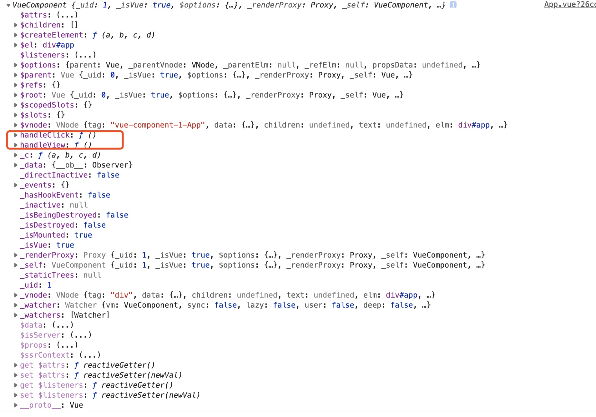

# initMethods

分析：

* 获取`props`，用来判断在methods中定义的方法名是否props定义的方法名重名
* 遍历`methods`对象
    * 判断`methods`对象中的属性是否是函数
    * 判断`methods`中的key是否存在于`props`
    * 判断`methods`中定义法方法是否存在于vm实例，并且方法是否是以$或者是_命名，给出警告
    * 如果`methods`对象中定义的属性是函数，将每个`key`对应的`value`赋值给`vm`

```javascript
// 初始化methods方法
function initMethods (vm: Component, methods: Object) {
  // 获取props，用来判断在methods中定义的方法名是否props定义的方法名重名
  const props = vm.$options.props
  // 遍历methods对象
  for (const key in methods) {
    // 非生产环境
    if (process.env.NODE_ENV !== 'production') {
      // 如果methods对象中的key对应的value的数据类型不是function,给出警告
      if (typeof methods[key] !== 'function') {
        warn(
          `Method "${key}" has type "${typeof methods[key]}" in the component definition. ` +
          `Did you reference the function correctly?`,
          vm
        )
      }
      // 如果定义了props，并且methods总中的key存在于props，给出警告
      if (props && hasOwn(props, key)) {
        warn(
          `Method "${key}" has already been defined as a prop.`,
          vm
        )
      }
      // 如果methods中定义法方法存在于vm实例，并且方法是以$或者是_命名
      if ((key in vm) && isReserved(key)) {
        warn(
          `Method "${key}" conflicts with an existing Vue instance method. ` +
          `Avoid defining component methods that start with _ or $.`
        )
      }
    }
    // 如果methods中定义的方式不是function类型，返回空函数noop
    vm[key] = typeof methods[key] !== 'function' ? noop : bind(methods[key], vm)
  }
}
```

example：

``` javascript
<template>
  <div id="app">
  </div>
</template>

<script>
export default {
  name: 'App',
  data() {
    return {
    };
  },
  mounted() {
    console.log(this)
  },
  methods: {
    handleClick() {
      console.log(1)
    },
    handleView() {
      console.log(1)
    }
  }
};
</script>

```

结果如下图：

