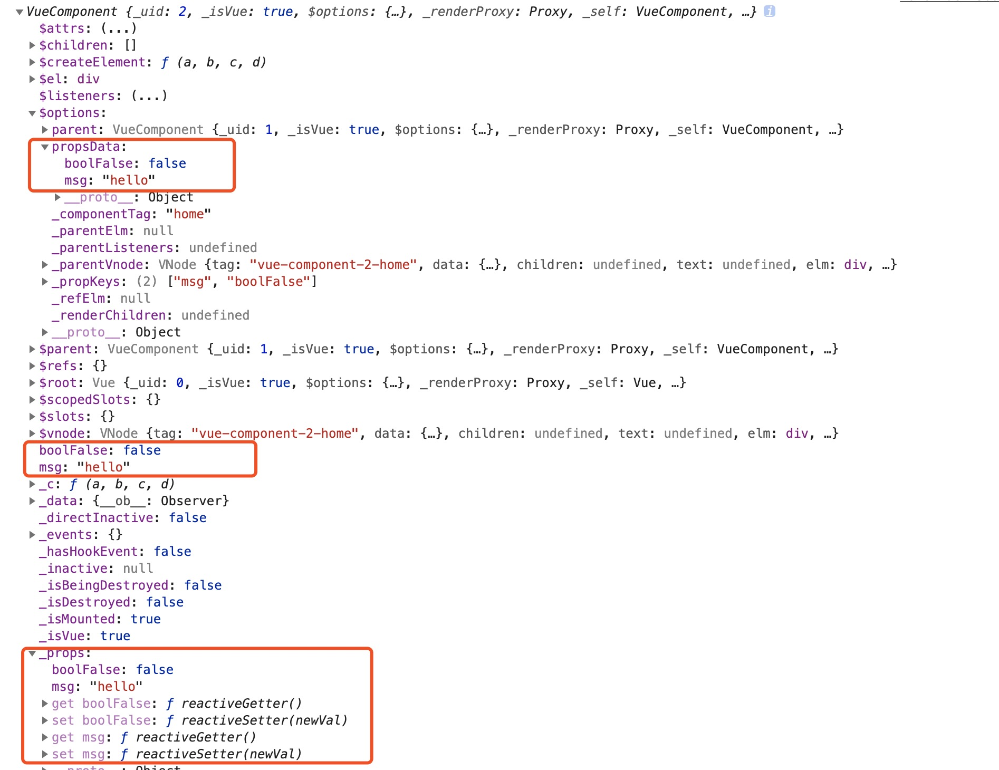
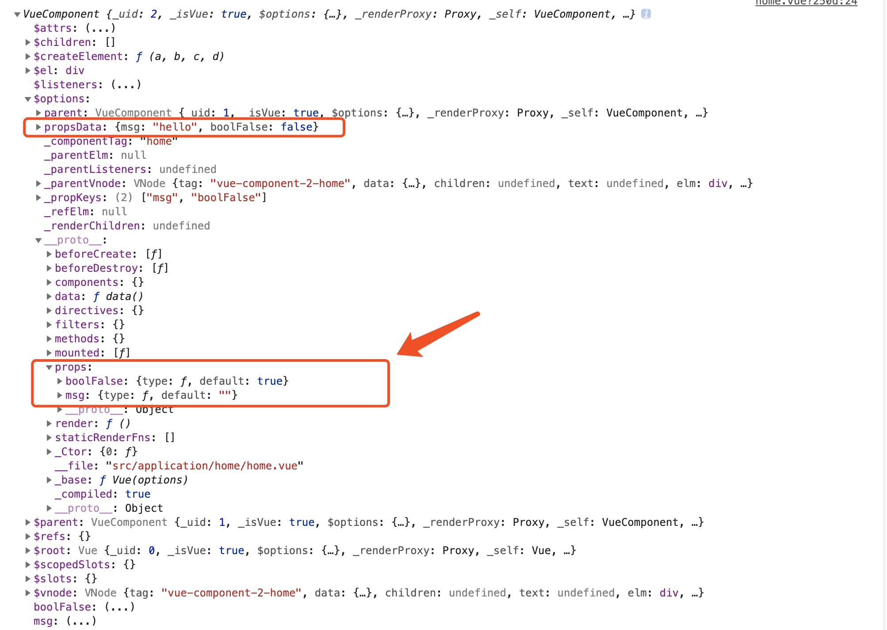

# initProps

分析：

* 获取`vm.$options.propsData`
* 遍历自定义属性`propsOptions`
    * 校验`vm.$options.propsData`中是否存在自定义的props
    * 非生产环境校验自定义的`props`是否是保留属性
    * `defineReactive()`暂时不分析
    * 通过[proxy](./initData.md) 方法，将`props`代理到`vm`上

``` javascript
/**
 * 定义初始化props的方法，
 * @param {*} vm : 当前vm实例
 * @param {*} propsOptions : 自定义的props对象
 * 作用：
 * 1、遍历定义的props，调用defineReactive方法，把props对应的值变成响应式，通过 vm._props.xxx 访问到定义 props 中对应的属性
 * 2、把vm._props.xxx 的访问代理到 vm.xxx 上
 */
function initProps (vm: Component, propsOptions: Object) {
  // 定义propsData： 存放 vm.$options.propsData，如果不存在，默认值{}
  const propsData = vm.$options.propsData || {}
  // 初始化 props，vm._props为空对象
  const props = vm._props = {}
  // cache prop keys so that future props updates can iterate using Array
  // instead of dynamic object key enumeration.
  // 初始化 keys，vm.$options._propKeys为空数组
  const keys = vm.$options._propKeys = []
  const isRoot = !vm.$parent
  // root instance props should be converted
  if (!isRoot) {
    toggleObserving(false)
  }

  // 遍历自定义的props对象
  for (const key in propsOptions) {
    // 将key存储到keys中
    keys.push(key)
    // 参数：自定义props对象的每个key，自定义props对象，传入的props，当前实例
    // 返回 propsData中的props对应key的value
    const value = validateProp(key, propsOptions, propsData, vm)
    /* istanbul ignore else */
    if (process.env.NODE_ENV !== 'production') {
      // 非生产环境
      // key（驼峰）变成为连接符（因为保留属性中存在'slot-scope'）
      const hyphenatedKey = hyphenate(key)
      // 判断自定义属性是否在保留属性中存在，如果存在则抛出异常提示
      if (isReservedAttribute(hyphenatedKey) ||
          config.isReservedAttr(hyphenatedKey)) {
        warn(
          `"${hyphenatedKey}" is a reserved attribute and cannot be used as component prop.`,
          vm
        )
      }
      // 定义响应式数据，传入vm._props,vm.$options.props.key,validateProp(key, propsOptions, propsData, vm)
      defineReactive(props, key, value, () => {
        if (!isRoot && !isUpdatingChildComponent) {
          warn(
            `Avoid mutating a prop directly since the value will be ` +
            `overwritten whenever the parent component re-renders. ` +
            `Instead, use a data or computed property based on the prop's ` +
            `value. Prop being mutated: "${key}"`,
            vm
          )
        }
      })
    } else {
      // 生产环境定义响应式数据
      defineReactive(props, key, value)
    }
    // static props are already proxied on the component's prototype
    // during Vue.extend(). We only need to proxy props defined at
    // instantiation here.
    // 如果遍历自定义的props不在vm实例上，则把key代理到vm上
    if (!(key in vm)) {
      proxy(vm, `_props`, key)
    }
  }
  toggleObserving(true)
}
```

例子：

App.vue

``` javascript
<template>
  <div id="app">
    <div>{{msg}}</div>
    <home :msg="msg" :bool-false="bool"></home>
  </div>
</template>

<script>
import Home from './application/home/home.vue'
export default {
  name: 'App',
  components: {Home},
  data() {
    return {
      msg: 'hello',
      bool: false
    };
  },
  mounted() {
    // console.log(this)
  }
};
</script>
```

home.vue

``` javascript
<template>
  <div>
    home
  </div>
</template>

<script>
// import Vue2 from './c'
export default {
  props: {
    msg: {
      type: String,
      default: ''
    },
    boolFalse: {
      type: Boolean,
      default: true
    }
  },
  data() {
    return {}
  },
  mounted() {
    console.log(this)
  },
  methods: {}
}
</script>

```



