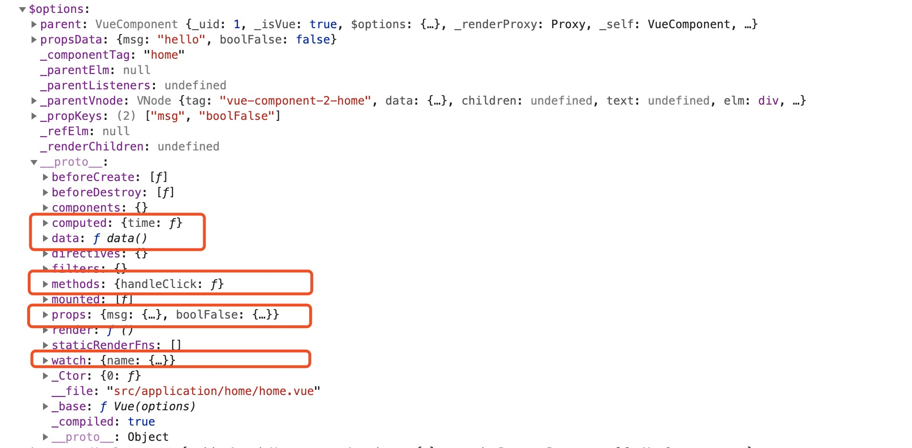

# initState

`initState`包括如下`5`个state的初始化（有顺序)

1. props
2. methods
3. data
4. computed
5. watch

源码分析：

```javascript
export function initState (vm: Component) {
  vm._watchers = []
  // 获取当前实例的配置项
  const opts = vm.$options
  // 当前实例的配置项存在props(如果有自定义的props)，则初始化props,比如：props:{type: String,default: ''}
  if (opts.props) initProps(vm, opts.props)
  // 当前实例的配置项存在methods，则初始化methods
  if (opts.methods) initMethods(vm, opts.methods)
  // 当前实例的配置项存在data，初始化data
  if (opts.data) {
    initData(vm)
  } else {
    observe(vm._data = {}, true /* asRootData */)
  }
  // 当前实例的配置项存在computed，则初始化computed
  if (opts.computed) initComputed(vm, opts.computed)
  // 当前实例的配置项存在watch，并且不是原生的watch，则初始化watch
  if (opts.watch && opts.watch !== nativeWatch) {
    initWatch(vm, opts.watch)
  }
}
```

总结：

* 从上代码可以看出，为什么`props`是在`data`之前执行的
* `props、methods、data、computed、watch`都是挂在`vm`实例的`$options`上的

example:

``` javascript
<template>
  <div>home</div>
</template>

<script>
export default {
  props: {
    msg: {
      type: String,
      default: ''
    },
    boolFalse: {
      type: Boolean,
      default: true
    }
  },
  data() {
    return {
      name: 'Jack',
      age: 10,
      className: '小班'
    }
  },
  mounted() {
    // console.log(this)
  },
  methods: {
    handleClick() {}
  },
  computed: {
    time() {
      return new Date()
    }
  },
  watch: {
    name: {
      handler(n){
        console.log(n)
      }
    }
  },
}
</script>

```

`vm`实例的`$options`上的`5`个state，如下图：



### [data的定义](https://cn.vuejs.org/v2/api/#data),组件的定义只接受 function

``` javascript
data() {
  return {}
}
```

### [prop的定义](https://cn.vuejs.org/v2/api/#props),可以是数组或对象，用于接收来自父组件的数据

数组类型

```javascript
props: ['title', 'likes', 'isPublished', 'commentIds', 'author']
```

对象类型

```javascript
props:{
  // 基本数据类型
  title: String,
  // 多个可能的类型
  propA: [String, Number],
  // 必填的字符串
  propB: {
    type: String,
    required: true
  },
  // 带有默认值的数字
  propC: {
    type: Number,
    default: 100
  },
  propD: {
    type: Object,
    // 对象或数组默认值必须从一个工厂函数获取
    default() {
      return { message: 'hello' }
    }
  },
  // 自定义验证函数
  propE: {
    validator: function (value) {
      // 这个值必须匹配下列字符串中的一个
      return ['success', 'warning', 'danger'].indexOf(value) !== -1
    }
  }
}
```

`type`类型检测

- String
- Number
- Boolean
- Array
- Object
- Date
- Function
- Symbol

### [computed的定义](https://cn.vuejs.org/v2/api/#props),计算属性的结果会被缓存，除非依赖的响应式属性变化才会重新计算

计算属性将被混入到 Vue 实例中。所有 getter 和 setter 的 this 上下文自动地绑定为 Vue 实例。

注意如果你为一个计算属性使用了箭头函数，则 this 不会指向这个组件的实例，

``` javascript
data() {
  age: 3,
  firstName: 'Jack',
  lastName: 'Ma'
},
computed: {
  realAge() {
    return this.age+1
  },
  fullName: {
    get() {
      return this.firstName+this.lastName
    },
    set(value) {
      this.firstName = value.firstName
      this.lastName = value.lastName
    }
  }

}
```

### methods的定义

methods 将被混入到 Vue 实例中。可以直接通过 VM 实例访问这些方法，或者在指令表达式中使用。方法中的 this 自动绑定为 Vue 实例。

``` javascript
methos: {
  handleClick() {...}
}
```

### [watch](https://cn.vuejs.org/v2/api/#watch)

一个对象，键是需要观察的表达式，值是对应回调函数。值也可以是方法名，或者包含选项的对象。Vue 实例将会在实例化时调用 $watch()，遍历 watch 对象的每一个属性

``` javascript
data() {
  return {
    id: 1,
    fullName: {
      first: '',
      last: ''
    }
  }
},
watch: {
  id(val,oldValue) {...},
  fullName: {
    handler(val,oldValue){...},
    deep: true,// 该回调会在任何被侦听的对象的 property 改变时被调用，不论其被嵌套多深
    immediate: true // 该回调将会在侦听开始之后被立即调用
  },
  'fullName.first': {//监听fullName对象的first属性值的变化
    handler(val,oldValue) {...}
  } 
}
```

接下来，我们详细的看一下这个五个属性的初始化方法
